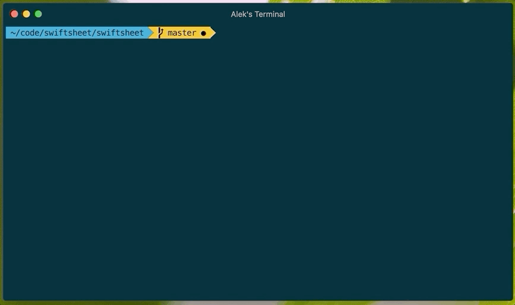

# 💻🏃‍♂️ select-run 

A CLI tool to interactively select one or many package.json npm scripts to run

## Installation
`npm i -g select-run`

## Usage
Once installed globally, run `select-run` from same directory that `package.json` is located.

Use arrow keys to navigate up and down the list and `<space>` to select a script. Likewise start typing anytime to filter list down in a real-time search. When all desired script have been selected press `<return>` to submit selections and begin running the scripts.

Inspired by [hawkins/interactive-scripts](https://github.com/hawkins/interactive-scripts)
